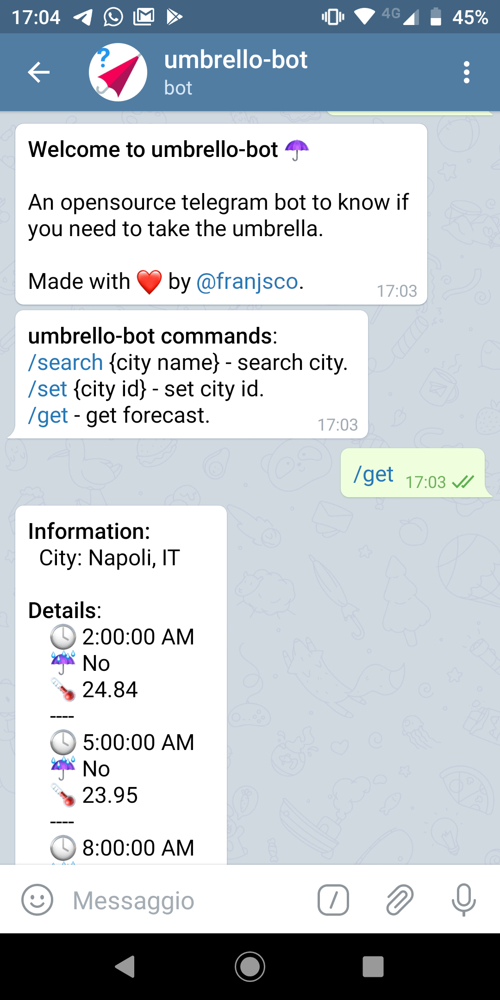

# umbrello-bot
An opensource telegram bot to know if you need to take the umbrella.




**Technologies**:

- Node.js
- Telegraf.js


## Usage


**umbrello-bot** uses the [umbrello-api](https://github.com/frsposito/umbrello-api) to get weather information.


### 1. Search the city.
Search the city id with:

```
/search [city name] 
```

*example: `/search Roma`*

It will send back the cities id.


### 2. Set the city.
Set the city  wth:

```
/set [city id]
```

*example: `/set 3169070`. (3169070= Rome, IT)*


### 3. Get the forecasts.
Get the forecasts with:
```
/get
```


## Installation
### Step by step.

1. Install Node.js and npm.
2. Configure [umbrello-api](https://github.com/frsposito/umbrello-api).
3. Clone this repository.
4. Install dependencies with `npm install`.
5. Create a new bot with BotFather on Telegram
6. Create env file or set environment variables (read: "Environment variables")
7. Build the code with `npm run build`.
8. Launch the bot with `npm run serve`.


#### Environment Variables.
```
NODE_ENV=production
TELEGRAM_TOKEN=token-here
UMBRELLO_API_URL=url-here

DB_HOST=mongodb://host:port/db
DB_USER=user
DB_PASSWORD=pass
```


## Build Docker image
```
# docker build -t umbrello-bot:1.0 .
# docker run umbrello-bot:1.0
```

## License
GPLv3

---
Made with ❤️ by Francesco Esposito ([@frsposito](https://github.com/frsposito))
