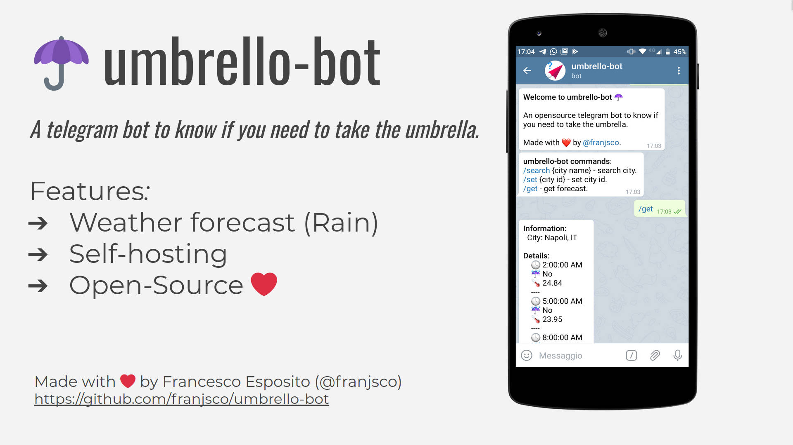

<h1 align="center">Welcome to umbrello-bot ☂️</h1>
<p>
  <a href="https://github.com/franjsco/umbrello-bot/blob/master/LICENSE" target="_blank">
    
  </a>
  <a href="https://twitter.com/franjsco" target="_blank">
    
  </a>
</p>

> A telegram bot to know if you need to take the umbrella.



## Install

1. Install Node.js and npm.
2. Install MongoDB.
3. Configure [umbrello-api](https://github.com/franjsco/umbrello-api).
4. Clone this repository.
5. Install dependencies with `npm install`.
6. Create a new bot with **@BotFather** on Telegram
7. Create env file or set environment variables (read: "Environment variables")
8. Build the code with `npm run build`.
9. Launch the bot with `npm run serve`.

#### Environment Variables.
```sh
NODE_ENV=production
TELEGRAM_TOKEN=token-here
UMBRELLO_API_URL=url-here

DB_HOST=mongodb://host:port/db
DB_USER=user
DB_PASSWORD=pass
```

## Usage

```sh
npm run start
```


#### 1. Search the city.
Search the city id with:

```
/search [city name] 
```

*example: `/search Roma`*

It will send back the cities id.


#### 2. Set the city.
Set the city  wth:

```
/set [city id]
```

*example: `/set 3169070`. (3169070= Rome, IT)*


#### 3. Get the forecasts.
Get the forecasts with:
```
/get
```

## Build Docker image
```
# cd umbrello-bot/
# docker build -t umbrello-bot .
# docker run umbrello-bot
```

## Author

👤 **franjsco (Francesco Esposito)**

* Website: https://franjsco.github.io/
* Twitter: [@franjsco](https://twitter.com/franjsco)
* Github: [@franjsco](https://github.com/franjsco)

## Show your support

Give a ⭐️ if this project helped you!

## 📝 License

Copyright © 2020 [franjsco (Francesco Esposito)](https://github.com/franjsco).<br />
This project is [GPL--3.0--or--later](https://github.com/franjsco/umbrello-bot/blob/master/LICENSE) licensed.

***
_This README was generated with ❤️ by [readme-md-generator](https://github.com/kefranabg/readme-md-generator)_